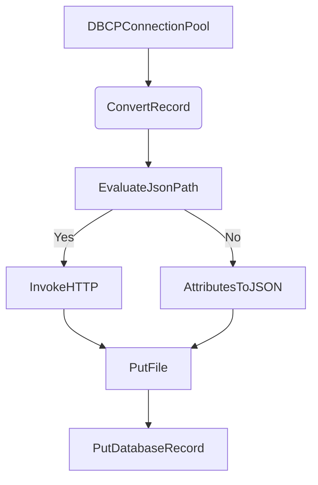

# Informe de Migración de NiFi1.x a 2.x

## Resumen Ejecutivo
Este informe detalla la migración de un flujo de datos de NiFi1.x a NiFi2.x. El análisis de componentes y la mapeo de propiedades a nivel de propiedad han sido realizados. Se han identificado un total de 11 componentes, incluyendo servicios de controlador y procesadores. La migración es considerada directa en su mayoría, con algunas propiedades renombradas en NiFi2.x.

## Inventario de Componentes
- **Servicios de Controlador:** 2 (DBCPConnectionPool, JsonTreeReader, JsonRecordSetWriter)
- **Procesadores:** 9 (ConvertRecord, EvaluateJsonPath, InvokeHTTP, PutFile, AttributesToJSON, PutDatabaseRecord, UpdateAttribute)

## Plan de Migración Detallado

- **componente_nifi_1:** DBCPConnectionPool
  - **equivalente_nifi_2:** DBCPConnectionPool
  - **notas:** El servicio de conexión a base de datos es compatible con NiFi2.x. Se han renombrado algunas propiedades para mejorar la claridad.

- **componente_nifi_1:** JsonTreeReader
  - **equivalente_nifi_2:** JsonTreeReader
  - **notas:** El lector de JSON es compatible con NiFi2.x. Las propiedades son directas.

- **componente_nifi_1:** JsonRecordSetWriter
  - **equivalente_nifi_2:** JsonRecordSetWriter
  - **notas:** El escritor de registros JSON es compatible con NiFi2.x. Las propiedades son directas.

- **componente_nifi_1:** ConvertRecord
  - **equivalente_nifi_2:** ConvertRecord
  - **notas:** El convertidor de registros es compatible con NiFi2.x. Las propiedades son directas.

- **componente_nifi_1:** EvaluateJsonPath
  - **equivalente_nifi_2:** EvaluateJsonPath
  - **notas:** La evaluación de JSON Path es compatible con NiFi2.x. Las propiedades son directas.

- **componente_nifi_1:** InvokeHTTP
  - **equivalente_nifi_2:** InvokeHTTP
  - **notas:** La invocación HTTP es compatible con NiFi2.x. Las propiedades son directas.

- **componente_nifi_1:** PutFile
  - **equivalente_nifi_2:** PutFile
  - **notas:** La escritura de archivos es compatible con NiFi2.x. Las propiedades son directas.

- **componente_nifi_1:** AttributesToJSON
  - **equivalente_nifi_2:** AttributesToJSON
  - **notas:** La conversión de atributos a JSON es compatible con NiFi2.x. Las propiedades son directas.

- **componente_nifi_1:** PutDatabaseRecord
  - **equivalente_nifi_2:** PutDatabaseRecord
  - **notas:** La escritura de registros en la base de datos es compatible con NiFi2.x. Algunas propiedades han sido renombradas.

- **componente_nifi_1:** UpdateAttribute
  - **equivalente_nifi_2:** UpdateAttribute
  - **notas:** La actualización de atributos es compatible con NiFi2.x. Las propiedades son directas.

## Puntos Críticos y Advertencias
- **Riesgos:** No se han identificado riesgos críticos. La migración es relativamente directa.

## Recomendaciones y Próximos Pasos
1. Revisar las propiedades renombradas en NiFi2.x para asegurar compatibilidad.
2. Validar las conexiones y flujo de datos en el entorno de NiFi2.x.
3. Realizar pruebas exhaustivas para asegurar la funcionalidad correcta.

## Diagrama de Flujo NiFi1.x (Mermaid)


## Diagrama de Flujo NiFi2.x (Mermaid)
```mermaid
graph TD
    A_2[DBCPConnectionPool (Renombrado)] --> B_2(ConvertRecord)
    B_2 --> C_2[EvaluateJsonPath]
    C_2 -->|Yes| D_2[InvokeHTTP]
    C_2 -->|No| E_2[AttributesToJSON]
    D_2 --> F_2[PutFile]
    E_2 --> F_2
    F_2 --> G_2[PutDatabaseRecord]
```
Thought: Final answer provided.